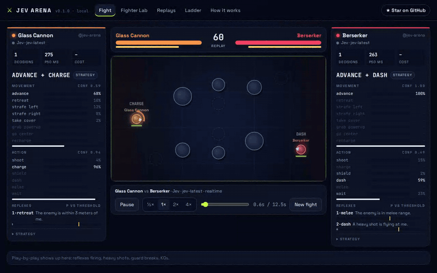

<div align="center">

# ⚔ Jev Arena

[](https://www.npmjs.com/package/jev-arena) [](https://github.com/Eliot5566/jev-arena/actions/workflows/ladder.yml) [](LICENSE)

**用白話英文寫一個格鬥機器人，讓 System One 模型每秒幫它做好幾次決定。**

即時對戰 · 用 Pull Request 加入天梯 · 大腦可以換：Jev、Laya、kev，或任何 LLM

**[▶ 線上看天梯](https://eliot5566.github.io/jev-arena/)** · [English](README.md)



</div>

---

LLM 很會想，但反應很慢。等聊天模型寫完「我應該舉盾」，重砲早就打到臉上了。

[Jev](https://typesafe.ai) 是另一種模型：它不寫文字，而是讀一段狀態，直接回傳**帶有校準機率的型別化決策**。依 TypeSafe 公布的數字，大約 70～500 毫秒就能回應，快到可以當格鬥機器人的「反射神經」。

所以在 Jev Arena 裡，**你**用英文寫戰術，**模型**負責在比賽進行中即時反應。

## 一個格鬥機器人＝一段文字

```yaml
name: Tortoise
author: your-github-handle
color: "#4ade80"
strategy: >
  I am a patient counter-puncher. I stay close to a pillar and let the enemy come to me.
  I shield the moment a heavy shot is on its way, then answer with bolts while the enemy
  is exposed. I only step out of cover to grab a repair kit or to finish a badly hurt enemy.
reflexes:
  - when: The enemy is charging a heavy shot, or a heavy shot is flying at me.
    do: shield
    threshold: 0.7
fallback: take_cover
```

這就是整個機器人。不用寫程式、不用算座標、也沒有 if 判斷式。

**一句話能打多遠？** 目前的 Jev 天梯上，*Zen* 只有一句話：「Win the fight. Do whatever a wise, calm fighter would do in this exact moment.」，沒有任何反射規則，卻拿下 **6 人中的第 2 名**，只比冠軍少 1 分 Elo。精心調整的 Sniper 則是 0 勝 10 敗。你的一段話能贏過一句話嗎？

| 名次 | 機器人 | Elo | 勝-和-敗 | 風格 |
|---|---|---|---|---|
| 1 | Trickster | 1063 | 8-0-2 | 繞圈、誘敵、最後一刻閃開 |
| 2 | **Zen** | 1062 | 8-0-2 | 一句話、零反射 |
| 3 | Tortoise | 1039 | 7-0-3 | 躲在柱子後面射擊 |
| 4 | Berserker | 994 | 5-0-5 | 衝上去近戰 |
| 5 | Glass Cannon | 938 | 2-0-8 | 重砲輸出、血薄 |
| 6 | Sniper | 905 | 0-0-10 | 遠距離，結果如表 |

<sub>真正的 Jev（jev-1.13.0）、即時模式、30 場全部 KO 分出勝負。完整表格和每場重播：[`ladder/LEADERBOARD.md`](ladder/LEADERBOARD.md)。</sub>

> 為什麼用英文？Jev 目前以英文的準確度最好，所以戰術建議用英文寫。介面和文件都有中文。

## 一次決策怎麼運作

1. **狀態**：引擎先把幾何計算做完，轉成白話事實，例如 `enemy charging heavy shot: YES, fires in 0.4s`。
2. **問題**：同一個請求裡平行問兩題 `Choice`：「怎麼移動？」（選項是當下合法的移動）和「手上做什麼？」（合法動作加上 `wait`）；每條反射規則再變成一題 `Noul`（是非題）。
3. **型別化答案**：每個移動、每個動作、每條反射都有一個機率，外加信心值。
4. **出招**：移動和動作各自決定。該類有反射超過門檻就先執行它；否則在信心夠高時採用機率最高的選項；再不然移動用你的保底動作、動作用 `wait`。所以機器人可以邊側移邊射擊，或邊後退邊舉盾。

畫面兩側的「心智面板」會即時顯示所有機率，你可以直接看到機器人「為什麼」這樣做。

## 10 秒開玩

```bash
npx jev-arena
```

打開 http://localhost:5173 按 **FIGHT**。不需要任何金鑰：沒有金鑰時會由離線的 **mock 大腦**（關鍵字規則，不是 AI）操控兩邊，讓你先玩玩看。**Replays** 分頁裡已經有 30 場真正的 Jev 天梯對戰，模型回傳的每個機率都看得到。

讓 Jev 上場：

```bash
TYPESAFE_API_KEY=ts-... npx jev-arena     # 金鑰在 https://console.typesafe.ai/keys 申請
```

> **成本（實測）**：一次決策約 1,400 個輸入 token。Jev 輸入每百萬 token 收 0.042 美元，輸出免費，所以一次決策約 0.00006 美元。實測中位延遲 230 毫秒，雙方每秒各決策約 3.7 次，打滿 60 秒的比賽約 **2～3 美分**；[`ladder/`](ladder/LEADERBOARD.md) 裡整個 30 場的天梯總共花了 **0.49 美元**。

## 兩種對戰模式

| 模式 | 世界會… | 比的是 |
|---|---|---|
| **即時（預設）** | 永遠不等人，大腦一回答就再問下一次 | 速度加判斷。250 毫秒的大腦每秒動 4 次；3 秒的大腦幾乎站著挨打 |
| **同步（Lockstep）** | 每 0.2 秒暫停，等兩邊都回答 | 只比判斷，延遲不影響結果 |

同一個機器人分別接上快的和慢的大腦，在即時模式下幾秒內就看得出差別。沒有金鑰也能試：`Mock` 對上 `Mock (slow, 1.5s)`。

## 換大腦

只要支援 TypeSafe **System One** 協定（`POST {state, questions}` 回傳型別化答案）就能接上：

| 大腦 | 啟用方式 | 說明 |
|---|---|---|
| `jev` | 設定 `TYPESAFE_API_KEY` | TypeSafe 的雲端模型，主角 |
| Laya、kev 等相容伺服器 | `JEV_ARENA_ENDPOINTS="laya=http://localhost:8000/v1/systemone"` | 自己架的開源模型 |
| `llm` | `LLM_MODEL=<模型名稱>` 加上 `OPENAI_API_KEY`，或用 `OPENAI_BASE_URL` 接 OpenRouter／Ollama／LM Studio | 透過 JSON 轉接的聊天模型，機率是自己報的，沒有校準 |
| `mock`／`mock-slow` | 永遠可用 | 離線規則，給試玩和 CI 用，沒有智慧 |

## 加入天梯

1. 在 **Fighter Lab** 分頁設計機器人：改英文、按 **TEST FIGHT**，反覆調整。
2. 按 **Copy YAML**，存成 `fighters/<你的 GitHub 帳號>.yaml`。
3. 開一個 Pull Request。CI 會驗證格式，並讓它和所有對手用 mock 大腦各打一場確認能跑。
4. 合併後，[天梯 workflow](.github/workflows/ladder.yml) 會用 repo 的 `TYPESAFE_API_KEY` 讓 Jev 跑完循環賽，更新 [`ladder/LEADERBOARD.md`](ladder/LEADERBOARD.md)，並把所有重播發布到網站。

參賽者不需要自己的 TypeSafe 金鑰，天梯用的是 repo 的大腦。

**公平規則**：戰術 ≤ 700 字元、反射 ≤ 4 條、招式備註 ≤ 160 字元。每個人的提示預算都一樣，天梯用同一個大腦。

## 寫機器人的訣竅

- **描述情境，不要描述座標。** 大腦看到的是 `line_of_sight: false` 這類事實，規則就用這些詞寫。
- **反射規則處理顯而易見的情況。** 「重砲飛過來 → 閃避」適合當反射；需要權衡的留給戰術。
- **門檻就是真的機率。** Jev 的數字有校準，0.9 代表「很確定才做」，0.6 代表「比較可能就做」。
- **善用保底動作。** 大腦沒把握時（信心低於 `min_confidence`），`take_cover` 這種安全動作比丟銅板好。
- **移動和動作分開寫。** 腳和手是兩個問題，「邊側移邊射擊」正是大腦的思考方式。
- **招式互相克制。** 遠距離側移可以躲光彈；重砲怕盾和閃避；盾怕近戰；近戰怕衝過去的路上被射。
- **想好縮圈時怎麼辦。** 25 秒後安全區開始往中央空地縮小（50 秒時剩 6 × 4 公尺），圈外每秒扣 6 血。只會躲的機器人要多寫一句「縮圈時往中間走」。

## 重播完全重現

引擎只用一個有種子的亂數產生器和精確的浮點運算，所以一場比賽完全由「種子＋每個決策落在哪個 tick」決定。重播檔就是這些資料加上每次決策的機率，檢視器能一格一格重現整場比賽和機器人當下的想法。`jev-arena verify replay.json` 可以驗證。

---

非官方社群專案，與 TypeSafe AI 無關。Jev 是 TypeSafe 的模型，「System One 模型」是他們對這類模型的稱呼。MIT 授權。
